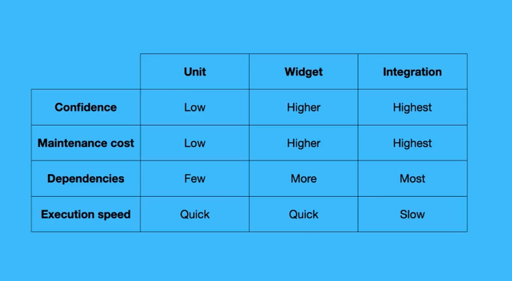

# Testes em Flutter

# O que são testes?

São formas de assegurar que nosso código cumpre os requisitos.

Eles ajudam também a termos certeza que uma nova atualização na base de código não quebrou algo que já funcionava.

## Como testar?

Temos duas formas:

- Manualmente: Muito mais lento e suscetível a erros.
- Automaticamente: Mais rápido e mais seguro se os testes forem bem escritos.

# Testes automatizados em Flutter

## Testes Unitários

- Para testar todo o código que não está diretamente ligado ao framework do Flutter.

## Widget Tests

- Para testar as classes que são ou dependem dos widgets do Flutter

## Testes de integração

- Para testar fluxos do app. É um teste criado do ponto de vista do usuário.
- Roda no device real / emulador, simulando um usuário real realizando os testes.
- É possível ver o teclado abrindo, campos de texto sendo preenchidos etc.

# Descrição do Projeto

É uma lista de artigos que também permite ver o artigo completo em uma segunda tela.

Basicamente, 2 telas:

- Lista dos artigos
- Tela de detalhes de um artigo.

## Packages usados

- `flutter_lorem` Para gerar o texto dos os artigos. [https://pub.dev/packages/flutter_lorem](https://pub.dev/packages/flutter_lorem)
- `provider` Para gerenciamento de estado. [https://pub.dev/packages/provider](https://pub.dev/packages/provider)
- `mocktail` Para facilitar o uso de mocks nos testes. [https://pub.dev/packages/mocktail](https://pub.dev/packages/mocktail)
- `integration_test` Para testes de integração. [https://pub.dev/packages/integration_test](https://pub.dev/packages/integration_test)
- `flutter_lints` Para ajudar a manter os códigos de testes limpos. [https://pub.dev/packages/flutter_lints](https://pub.dev/packages/flutter_lints)

## Testes Unitários

- Os nomes dos arquivos de testes devem obrigatoriamente sempre terminar com "_teste". Caso não, esse arquivo não será reconhecido pelo comando `flutter test`, podendo gerar um erro parecido com esse aqui: (esse erro aconteceu pois eu tinha somente um arquivo de teste e ele não estava com o nome certo, portanto o comando não encontrou nenhum arquivo de teste para rodar).

- Para testar o estado de uma variável antes e depois de uma requisição, como por exemplo o `isLoading` abaixo, você precisa guardar o future dentro de uma variável, fazer o expect, e só depois dar o `await`.

## Widget tests

- A grande diferença de widget test para integration test, é que o widget test testa detalhes de um widget específico. Enquanto que o integration test testa fluxos inteiros.
- Diferente de integration test, o widget test não aparece no emulador.

Um exemplo de teste bem simples é como o abaixo. Ele basicamente checa se o widget "x" tem algum Text com o texto "News".

Para o caso específico do ``NewsPage``, vou ter problemas se eu rodar esse teste.

- O teste vai falhar pois não existe um `mediaQuery` na árvore de widgets, e o Scaffold precisa disso.
- Também não vai ser possível encontrar um `provider` na árvore de widgets, e o NewsPage precisa disso para mostrar os valores.

Para resolver isso, precisamos passar um widget no `pumpWidget` que possa prover isso tudo que o `NewsPage` precisa.

Se olharmos no main.dart, veremos que o widget principal é um ``MaterialApp``. Podemos usar a mesma estrutura no teste.

- Vamos criar um método que retorne essa estrutura toda que é necessária.
- E também já passar os mock para que a página possa ser carregada.

O código ficaria assim:

Atenção para a mudança na hora de chamar o `pumpWidget`. Nele agora passamos o método que retorna toda a árvore de widget que precisamos, e precisamos chamar ele usando um `await` também pois o `pumpWidget` retorna um Future.

Com isso, os testes passam 🎉

Agora vamos testar se o loading indicator aparece enquanto os artigos são carregados:

Pra isso, precisamos que o mock funcione com um delay. Vamos criar um novo método de mock que faça isso:

E o teste ficaria assim:

Porém, esse teste vai falhar. Rodando ele, vemos que o `CircularProgressIndicator` não foi encontrado.

Isso acontece, pois o `expect` acaba rodando muito rápido, rápido o suficiente para que não tenha dado tempo de o widget mostrar o `CircularProgressIndicator`. Isso pois, para o loading aparecer, o widget precisa chamar o service, notificar o provider etc. Enfim, para resolver isso, podemos chamar o método `pump`. Ele permite dar um delay no teste para podermos fazer o `expect` com mais segurança. Ficaria assim:

Com isso, o erro está resolvido. 

Mas ainda temos mais coisas para tratar. Rodando os testes de novo, iremos ver um erro que menciona o Duration de 2 segundos.

Este acontece porque, de forma resumida, o método do teste termina enquanto existe um `timer` rodando ainda. Este `timer` vem do Duration de 2 segundos que colocamos no mock. Acredito que sempre que estivermos em casos assim, chamando o `pumpAndSettl()`do tester, o problema deve ser resolvido.

### finding by key

Tentar encontrar pela key é bem comum, pois muitas vezes poderemos ter vários widgets do mesmo tipo na tela. Pra esses casos, tentar encontrar pela key é uma boa.

Nesse exemplo, eu faço o mesmo expect do exemplo anterior, mas dessa vez, em vez de tentar encontrar pelo tipo `CircularProgressIndicator`, eu tento encontrar pela key 

### Testando a lista de articles

Agora para testar a lista de articles, precisamos continuar chamando o `teste.pump()` (área cinza aqui, não entendi muito bem ainda a razão de precisar desse método). Mas dessa vez, não precisamos passar um `duration` pois vamos usar o mock que retorna os articles sem ter um duration, ou seja, os articles seram retornados imediatamente. Quando testamos o indicator, precisamos do `duration` no `pump` porque era necessário um tempo para que o indicator aparecesse. No caso da lista, isso não é necessário (área cinza. Não entendi muito bem a razão de o problema acontecer no indicator e não na lista).

Para nos certificarmos de que todos os artigos estão aparecendo, podemos usar um for para fazer os expects.

O teste ficaria assim:

## Integration tests

Os testes de integração são bem parecidos com os de widget. A estrutura do teste é basicamente a mesma, pois usamos `expect`, `WidgetTester` e `pump`, `pumpWidget` etc.

Porém, esses testes ficam em uma estrutura de pasta diferente. Em vez de ficar na pasta `test`, os arquvios de integration test devem ficar na pasta `integration_test`.

### Integration tests devem ser simples

Esses testes são muito mais custosos para serem executados, pois esses rodados na plataforma real mesmo. Então, esses testes devem focar mais em integrações que não dá para testar com widget tests, como navegação de uma tela pra outra etc.

Por exemplo, nesse projeto, vamos testar apenas se o clique em um artigo da lista de artigos leva para a tela de detalhes do artigo que mostra o artigo que foi realmente clicado. Veja que a estrutura do teste é bem parecida com a de um widget test.

Obs: o `pumpAndSettle()` é necessário pois existe uma animação na transição entre as duas telas.

